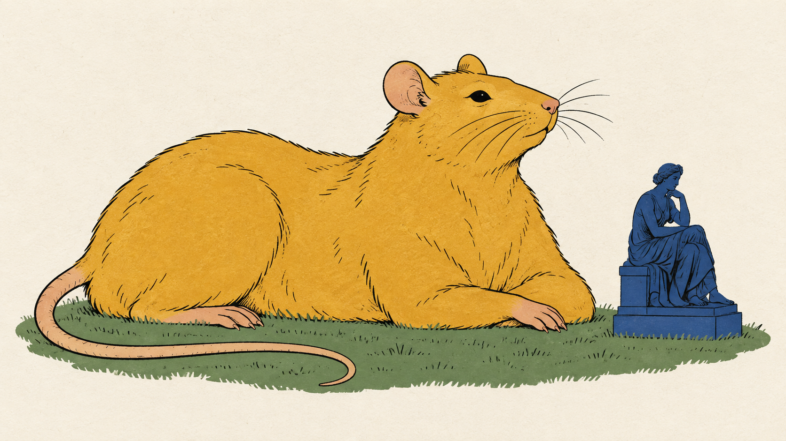
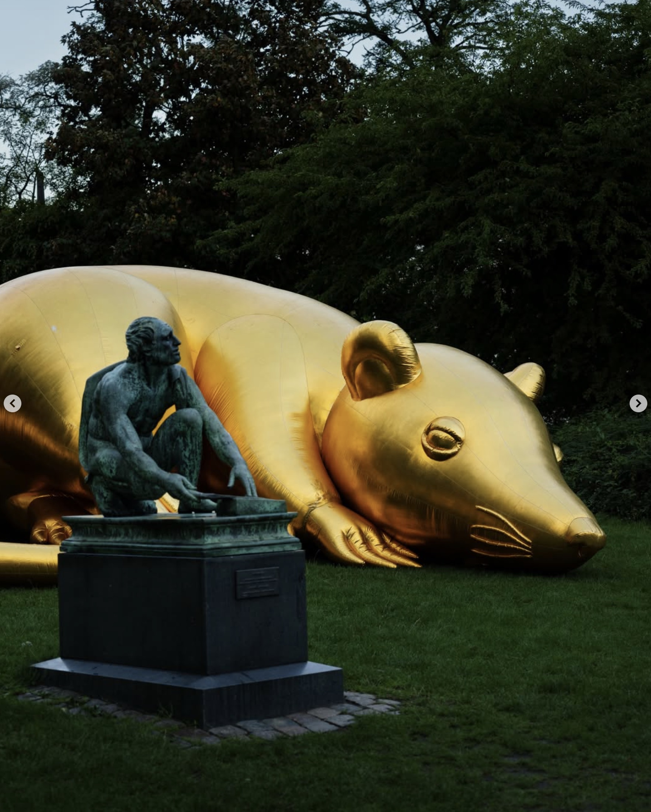
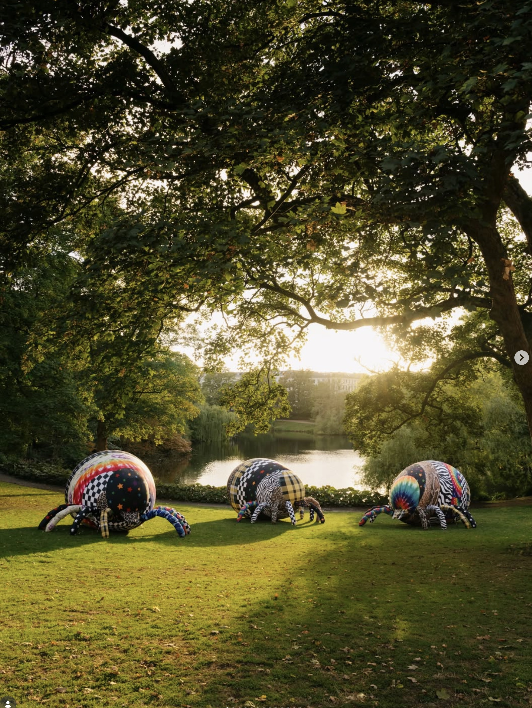

# Endelig en rotte, København ikke kan ignorere

Esben Weile Kjærs THIRST TRAP giver skadedyrene hovedrollen i Ørstedsparken. Bag guldet og de psykedeliske mønstre ligger en langt mere fræk idé: Den pæne by tilhører også dem, der ødelægger billedet.

Af Liv Brandt · Feature

*Illustration: Apropos Magazine / AI. Fri fortolkning, ikke et udstillingsfoto.*

Den gyldne rotte har ikke tænkt sig at undskylde. Den ligger ved siden af en lille bronzefigur, fylder aldeles urimeligt og får den etablerede kunst til at ligne noget, man har glemt at stille på plads. Jeg er allerede på rottens side. Det er befriende at se en udstilling, hvor ambitionen er synlig, før nogen har forklaret den med et ord, der slutter på »praksis«.

I Esben Weile Kjærs THIRST TRAP er størrelsesforholdene løbet af med skadedyrene. Rotterne er guldfarvede, de kødædende planter har sølvblanke gab, og flåterne er klædt i mønstre, der nægter at enes. Værkerne indtager Ørstedsparken under [Golden Days](https://www.goldendays.dk/udstilling-thirst-trap-af-esben-weile-kjaer). Her er rigeligt at kigge på. Heldigvis er der også noget at blive hængende i.

Det imponerende er ikke bare størrelsen. Den kunne enhver med en luftpumpe og et generøst budget forsøge sig med. Det er præcisionen i sammenstødet: et dyr, vi helst vil slippe for, får den behandling, vi normalt reserverer til nogen, der skal hyldes. Guldet gør arbejdet. Pludselig ser rotten ud, som om parken er anlagt til ære for den.

## Skadedyret har fået råd til guld

En rotte i græsset er normalt anledning til at kontakte nogen. En gylden kæmperotte er anledning til at finde telefonen frem. Det lille skift er næsten pinligt at opdage hos sig selv. Åbenbart kan afsky godt ommøbleres, hvis indpakningen er overbevisende nok.

På udstillingsbillederne er den siddende rotte både enorm og mærkeligt veltilpas. De små forpoter hænger foran kroppen; halen tegner en stor bue hen over græsset. Der er noget selvtilfreds over den, som jeg godt kan lide. Den forsøger ikke at bevise, at den er nyttig. Den har bare taget plads.

Ved siden af bronzefiguren bliver guldet en vittighed om monumenter. Bronze har tyngde og patina. Den oppustelige overflade har syninger og luft. Alligevel er det rotten, der vinder kampen om opmærksomheden. Den gamle figur beholder sin sokkel, men har mistet kontrollen over selskabet.

Jeg læser det som en kærkommen forstyrrelse af den respekt, vi kan komme til at vise materialer helt automatisk. Er noget værdigt, fordi det er støbt? Bliver det mindre interessant, fordi det kan tømmes for luft? Det midlertidige kan godt stille et spørgsmål, der bliver siddende længere end en mindeplade.

*THIRST TRAP i Ørstedsparken. Udstillingsfoto fremsendt til redaktionen; fotograf ikke oplyst.*

## Parken har aldrig været uskyldig

Ørstedsparken er et præcist sted at lade den konflikt folde sig ud. Dens grønne rum har også været mødesteder for mænd, der søger andre mænd. [Københavns Museum](https://cphmuseum.kk.dk/nyheder/podcast-queer-i-koebenhavn-gennem-1000-aar) fortæller om parkens plads i byens queerhistorie med møder tilbage i 1800-tallet.

Den historie ændrer blikket på idyllen. Et buskads kan være smukt fra stien og give afskærmning fra en anden vinkel. Når nogen ønsker bedre udsyn, kan andre miste muligheden for at være i fred. Det samme landskab kan tilbyde forskellige mennesker vidt forskellige friheder.

Golden Days knytter selv værkerne til parkens cruisinghistorie og beskriver, hvordan beskæring har begrænset skjulte rum. Jeg synes, udstillingen bliver stærkere, når man holder fast i den konkrete forbindelse. Så handler de store dyr om mere end en behageligt løs opfordring til at acceptere forskellighed. De står i et rum, hvor synlighed og diskretion faktisk betyder noget.

Det kræver samtidig lidt omtanke at tale om mennesker gennem skadedyr. Queer liv er selvfølgelig ikke noget, der skal forklares med en flåt. For mig ligger forbindelsen i den magt, der udpeger noget som uønsket: Hvem får lov at bestemme, hvad der hører til? Man behøver ikke overtage betegnelsen for at undersøge, hvem der bruger den.

Jeg bliver mere optaget af den kamp end af forestillingen om en by, hvor alle bare skal være synlige hele tiden. Retten til at fylde er vigtig. Retten til at slippe for andres blik er det også. En fri park må kunne rumme begge ønsker, selv om det gør den vanskeligere at holde pæn på billeder.

## Flåten er klædt bedre på end sin undskyldning

Flåterne har zebra, tern, leopardpletter og farver, der flyder ud i hinanden. Deres runde kroppe og buttede ben gør dem næsten nuttede. Jeg får mere lyst til at studere mønstrene end til at holde afstand. Det er en temmelig effektiv overflade at give et dyr, hvis selskab jeg ellers ville afslå på stedet.

Plantegabene skruer til gengæld op for tænderne. De blanke flader ligner fest, mens formen lover det modsatte af en varm velkomst. Tiltrækning og fare findes i samme objekt. Man skal ikke vælge mellem dem for at forstå joken.

Titlen THIRST TRAP passer til den dobbelthed. I udstillingens egen præsentation handler den både om at lokke blikket til og om at tage kontrollen over at blive set. Min læsning er, at værkerne også gør beskuerens smag til en del af fælden. Vi opdager noget uimodståeligt dér, hvor vi havde regnet med at være enige om, at det var frastødende.

*THIRST TRAP i Ørstedsparken. Udstillingsfoto fremsendt til redaktionen; fotograf ikke oplyst.*

## Gerne et billede. Også gerne en tanke

Den oplagte indvending er selvfølgelig, at gulddyr og psykedeliske flåter kan ende som baggrund for et pænt opslag. Noget stort og fotogent er ikke automatisk en god kunstnerisk idé. Man kan sagtens lokke folk til at kigge uden at give dem noget at se.

Men jeg synes, THIRST TRAP har mere på spil. Forholdet til parkens eksisterende skulpturer giver overdrivelsen retning. Dyrene behøver ikke ligne natur for at sige noget om vores forhold til den. Og den lokale historie forhindrer stedet i bare at være et stykke praktisk græs under værkerne.

Det er den slags ambition, jeg gerne vil have mere af i offentlig kunst: noget, der tør være umiddelbart dragende og stadig giver modstand, når man prøver at forstå det. Man må gerne komme for guldet. Man behøver ikke kunne redegøre for parkens historie for at blive nysgerrig på den.

Jeg har langt større tiltro til den nysgerrighed end til kunst, der virker fornærmet over, at nogen gerne vil kunne lide den. Her kan begejstringen godt komme først. Det afgørende er, om den åbner for noget andet bagefter.

Den lille bronzefigur får sandsynligvis ro igen. Indtil da har den fået en nabo, som ikke respekterer, at nogen var her først. København kunne godt bruge flere af den slags besøg.

THIRST TRAP kan opleves i Ørstedsparken til og med 12. september 2026.
